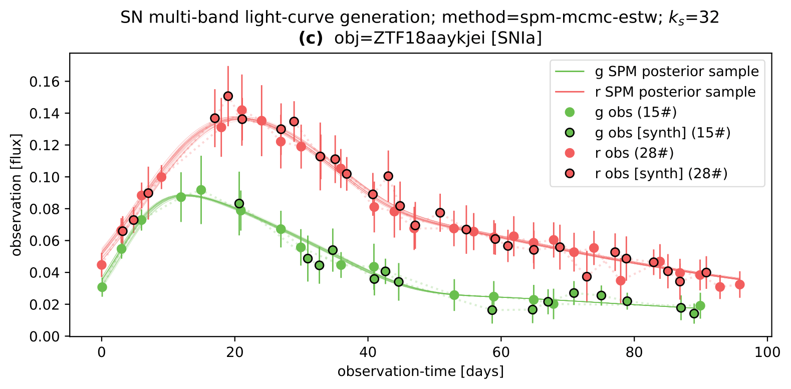

 
# SNe Light-Curves Synthetic 🌟



## Installation

## How to use
To execute [master_run.sh](master_run.sh) just run the following command in the terminal:
```bash
bash master_run.sh
```

```bash
bash watch_files.sh
```

## Data

surveys-data: https://drive.google.com/drive/folders/1pkDu-iF_vJTWrGxVmeJJls7Z8Q1jd3ek?usp=sharing


surveys-save: https://drive.google.com/drive/folders/1g_9ZRypfL8__ml3vYx2gxCpZWzf3iORd?usp=sharing

Public data for this project: https://drive.google.com/drive/folders/1-5TI-WJCoSYvUOrw_eM5cRLVVPJyGGdr?usp=sharing

`save/`

`save/obse_sampler`
`save/ssne`
`save/ssne_figs`

## TO DO
- to delete sne_specials.csv as it is doing nothing

## References
Please, feel free to see the thesis associated with this work here: ???